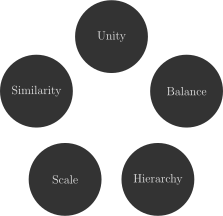
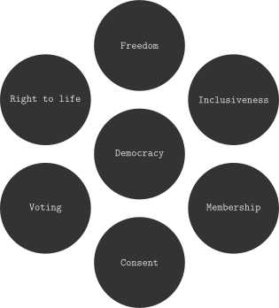

<!--
SPDX-FileCopyrightText: 2021 Galagic Limited, et. al. <https://galagic.com>

SPDX-License-Identifier: CC-BY-SA-4.0

figular generates visualisations from flexible, reusable parts

For full copyright information see the AUTHORS file at the top-level
directory of this distribution or at
[AUTHORS](https://gitlab.com/thegalagic/figular/AUTHORS.md)

This work is licensed under the Creative Commons Attribution 4.0 International
License. You should have received a copy of the license along with this work.
If not, visit http://creativecommons.org/licenses/by/4.0/ or send a letter to
Creative Commons, PO Box 1866, Mountain View, CA 94042, USA.
-->

# Concept/Circle

A circle of text blobs with (optionally) one in the centre. It can be rotated
and the font changed.

* [Suggested Use](#use)
* [Examples](#examples)
* [Parameters](#parameters)

## Suggested Use

* A circular flow of ideas, concepts or workflow.
* A collection of concepts of equal weight
* A central concept with multiple contributing/ancillary concepts

## Examples



[Elements of the design of the art (wikipedia.org)](https://en.wikipedia.org/wiki/Visual_design_elements_and_principles#Elements_of_the_design_of_the_art)

At the cmdline:

```bash
fig -concept/circle \
  blob=Unity blob=Balance \
  blob=Hierarchy blob=Scale blob=Similarity

```

---



[The cornerstones of Democracy (wikipedia.org)](https://en.wikipedia.org/wiki/Democracy)

At the cmdline:

```bash
fig -concept/circle \
  blob=Democracy blob=Freedom \
  blob=Inclusiveness blob=Membership \
  blob=Consent blob=Voting \
  "blob=Right to life" \
  middle=true font=cmtt
```

---

## Parameters

|Name|Type|Default|Description|
|----|----|-------|-----------|
|blob|String|None|Add a blob with the given text, there must be at least one. Blobs are drawn in sequence from the top then clockwise around the circle.|
|middle|Bool|False|Put the first blob in the centre of the circle|
|degreeStart|Integer|0|Rotate the circle by a number of degrees|
|font|String|cmr (Computer Modern Roman)|Specifies a font from the [Computer Modern (wikipedia.org)](https://en.wikipedia.org/wiki/Computer_Modern) font family. Further documentation is needed here. Other possible values include: `cmss` for Computer Modern Sans and `cmtt` for Computer Modern Typewriter. |
